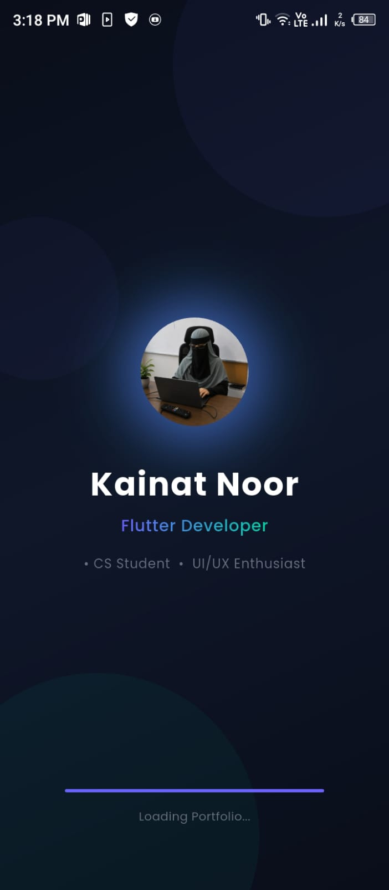
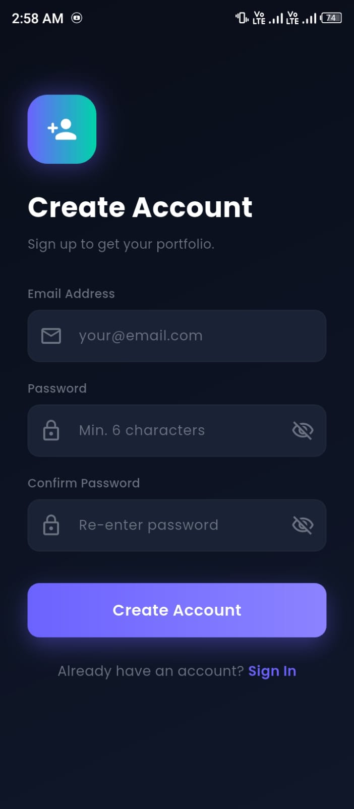
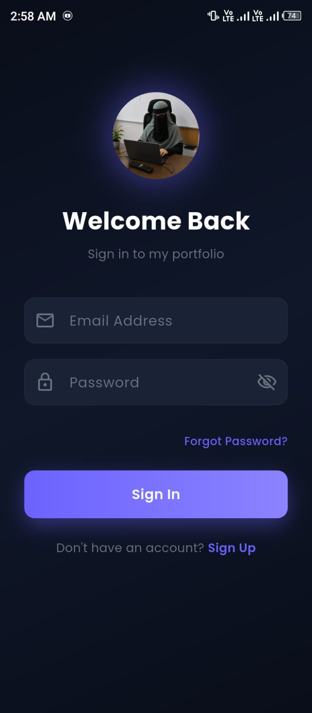
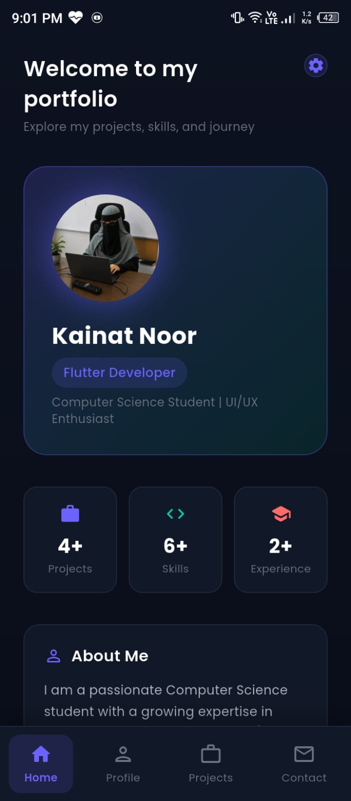
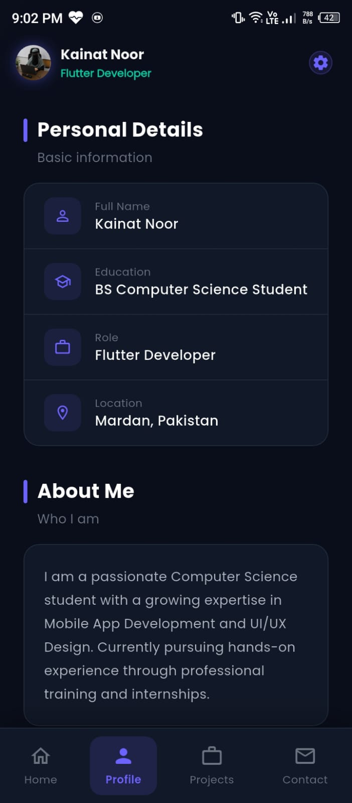
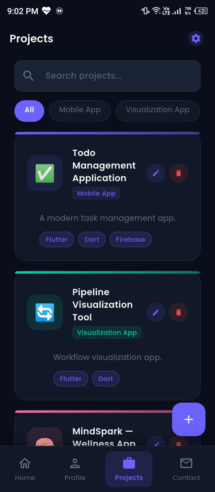
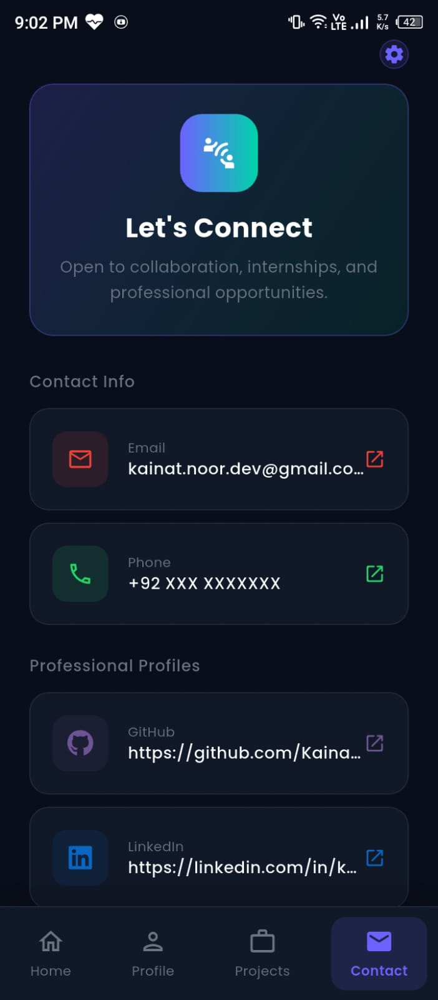
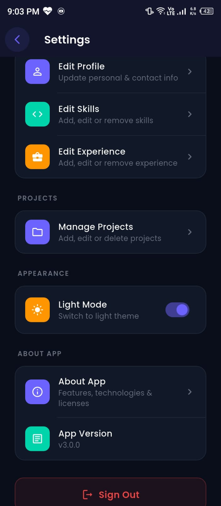

# Portfolio Mobile Application

## Overview

A complete mobile portfolio application built with Flutter and Firebase that allows users to manage and showcase their professional portfolio through an intuitive mobile interface.

---

## Features

- User Authentication (Sign Up, Sign In, Sign Out, Forgot Password)
- Profile Management (Edit name, title, bio, photo, location)
- Skills Section with animated progress bars
- Work Experience Management
- Projects Showcase with full details
- Search and Filter projects by name and category
- Dark Mode and Light Mode
- API Integration via Firebase Cloud Firestore
- Responsive UI across all screen sizes
- Offline Support with local caching

---

## Technologies Used

- Flutter
- Dart
- Firebase Authentication
- Cloud Firestore
- Provider (State Management)
- SharedPreferences
- Google Fonts
- Image Picker
- URL Launcher

---

## Screenshots

| Splash | Sign Up | Sign In |
|--------|---------|---------|
|

|

|

|

| Home | Profile | Projects |
|------|---------|----------|
|

|

|

|

| Contact | Settings |
|---------|----------|
|

|

|

---

## Installation

1. Install Flutter SDK from https://flutter.dev
2. Clone or download this project
3. Run the following commands:

    flutter pub get

    flutter run

4. Firebase Setup:
    - Create a project at https://console.firebase.google.com
    - Enable Authentication with Email/Password
    - Enable Cloud Firestore
    - Download google-services.json and place in android/app/
    - Update lib/firebase_options.dart with your project values

---

## Developer

Name: Kainat Noor

Role: Flutter Developer Intern

Company: Codiora Software House 

Location: Mardan, Pakistan

LinkedIn: https://linkedin.com/in/kainat-noor-02a5873b1

-------

